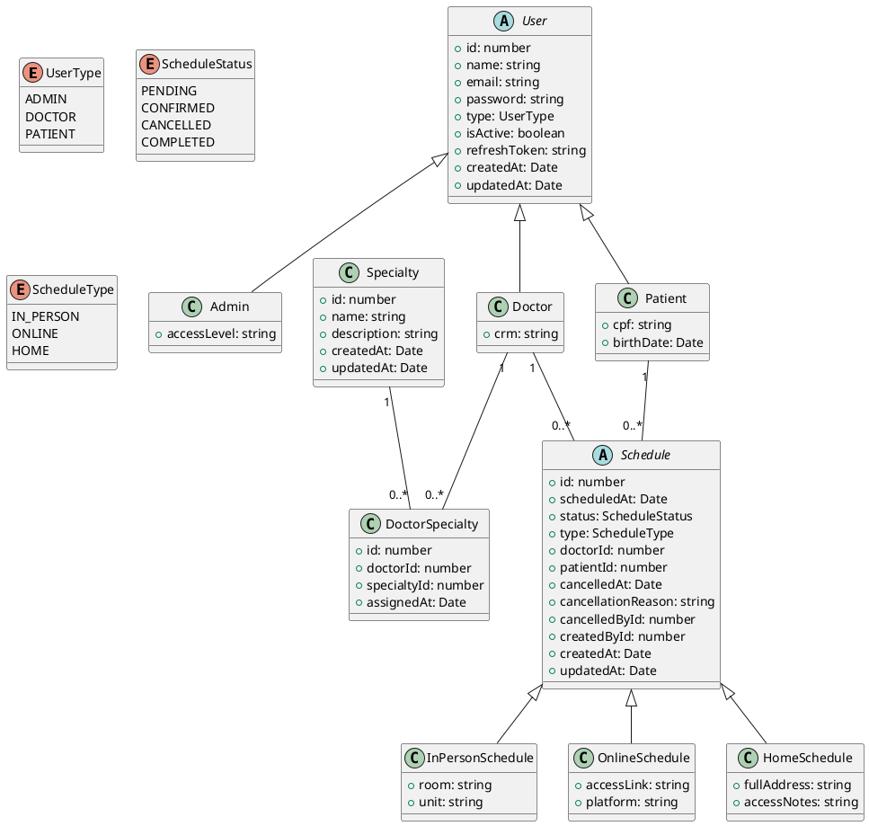

# Relatório — Etapa 1
## SGCM — Sistema de Gestão de Clínica Médica

---

## 1. Integrantes e Contribuições

| Integrante | Contribuições |
|---|---|
| Willian Charantola da Costa | Configuração inicial do projeto, estrutura de módulos, implementação das entidades com herança (User, Schedule e subclasses), configuração do TypeORM com SQLite, implementação do UsersModule completo (service, controller, DTOs), configuração global do ValidationPipe e ClassSerializerInterceptor, implementação do filtro de exceção global no formato RFC 7807. |
| João Pedro de Melo Hentz | Implementação do SpecialtiesModule (service, controller, DTOs), implementação do SchedulesModule completo com ciclo de vida de status e validação de conflito de horário, implementação dos controllers dedicados DoctorsController e PatientsController, configuração do Swagger com documentação de todos os endpoints obrigatórios, resolução de dependências circulares entre módulos com forwardRef. |

A divisão de trabalho foi organizada por módulo de domínio — cada integrante ficou responsável por módulos completos, do banco ao endpoint, o que facilitou a rastreabilidade das decisões e reduziu conflitos de merge. As revisões de pull request foram feitas em conjunto antes de cada merge na branch `stage-1`.

---

## 2. Diagrama de Classes

O diagrama abaixo reflete o sistema conforme implementado na Etapa 1. Foram mantidas as hierarquias de herança previstas no diagrama base, com a adição do campo `cancelledById` e `createdById` como colunas de chave estrangeira explícitas nas entidades de agendamento, facilitando queries sem necessidade de join.

---

## 3. Decisões Técnicas

### 3.1 Estratégia de herança para usuários — Single Table Inheritance (STI)

**Decisão:** utilizar Single Table Inheritance (STI) para a hierarquia de `User`.

**Alternativas consideradas:**
- *Concrete Table Inheritance (CTI):* cada subclasse em sua própria tabela, sem tabela base. Consultas por subclasse são simples, mas listagens mistas exigem UNION entre tabelas.
- *Class Table Inheritance (CTI com join):* tabela base + tabela por subclasse. Normalizado, mas exige JOIN em toda consulta, o que aumenta a complexidade com SQLite.
- *Single Table Inheritance (STI):* uma única tabela com coluna discriminadora `type`. Listagens mistas são triviais (sem JOIN), e o SQLite se comporta de forma previsível.

**Justificativa:** o endpoint `GET /users` precisa retornar usuários de qualquer perfil misturados, com filtro por `type`. Com STI isso é uma query simples sem JOIN. As colunas extras de `Doctor` (crm) e `Patient` (cpf, birthDate) ficam na mesma tabela com valor nulo para os outros perfis — trade-off aceitável dado o número reduzido de atributos específicos por subclasse.

**Impacto futuro:** quando novos perfis forem adicionados na Etapa 3, basta criar uma nova `@ChildEntity` sem alterar a tabela existente.

---

### 3.2 Estratégia de herança para agendamentos — Single Table Inheritance (STI)

**Decisão:** utilizar também STI para a hierarquia de `Schedule`.

**Justificativa:** a mesma lógica de listagens mistas se aplica — `GET /schedules` retorna agendamentos de qualquer modalidade. Com STI, filtros combinados por `status`, `type`, `doctorId` e intervalo de datas ficam em uma única query. Os atributos específicos por modalidade (`room`, `unit`, `accessLink`, etc.) são poucos e bem delimitados, tornando o trade-off de colunas nulas aceitável.

---

### 3.3 Granularidade dos controllers — controllers dedicados por perfil

**Decisão:** criar controllers dedicados `DoctorsController` e `PatientsController` dentro do `UsersModule`, além do `UsersController` genérico.

**Alternativas consideradas:**
- *UsersController único:* todos os endpoints em um controller, usando `type` como parâmetro ou parte da rota. Menos arquivos, mas rotas menos expressivas e DTOs misturados.
- *Controllers dedicados:* `DoctorsController` e `PatientsController` com rotas semânticas como `GET /doctors/:id/specialties`. Mais arquivos, mas documentação Swagger mais clara e separação natural de responsabilidades.

**Justificativa:** a rota `/doctors` retorna uma visão enriquecida com especialidades incluídas, que `/users?type=DOCTOR` não retorna. Essa diferença semântica justifica controllers separados. A documentação no Swagger fica organizada por tag (`Users`, `Doctors`, `Patients`), facilitando a navegação.

---

### 3.4 Verificação de unicidade — no service antes de persistir

**Decisão:** verificar unicidade (e-mail, CRM, CPF, nome de especialidade) no service antes de tentar persistir, lançando `ConflictException` explícita.

**Alternativas consideradas:**
- *Capturar erro do banco:* tentar persistir e capturar o erro `SQLITE_CONSTRAINT_UNIQUE` no filtro global. Mais simples, mas a mensagem de erro é genérica e não identifica qual campo causou o conflito.
- *Verificar no service:* buscar pelo campo único antes de persistir e lançar exceção descritiva. Mais verbose, mas produz mensagens como "Já existe um médico com o CRM 12345-SP" que orientam o cliente com precisão.

**Justificativa:** mensagens descritivas são exigência explícita do RFC 7807 adotado. O custo de uma query extra de verificação é aceitável. O filtro global ainda trata erros de constraint como fallback para casos de concorrência.

**Limitação conhecida:** em cenários de alta concorrência, dois requests simultâneos podem passar pela verificação ao mesmo tempo. Para esta etapa com SQLite esse risco é desprezível, mas seria mitigado com transações ou locks na Etapa 3.

---

### 3.5 Remoção versus inativação de usuários

**Decisão:** inativação lógica — o campo `isActive` é alterado para `false` em vez de remoção física do registro.

**Justificativa:** remoção física deixaria referências inválidas em agendamentos já registrados. A inativação preserva o histórico e mantém a integridade referencial. Usuários inativos não aparecem nas listagens padrão (`isActive = true` é filtro padrão em todos os endpoints de listagem). A busca por `id` retorna o usuário independentemente do status.

**Agendamentos ativos:** um usuário com agendamentos nos status `PENDING` ou `CONFIRMED` não pode ser inativado. Esses são os status considerados "ativos" para fins desta regra — agendamentos `CANCELLED` e `COMPLETED` não bloqueiam a inativação.

---

### 3.6 DTOs de agendamento — DTO único com validação condicional

**Decisão:** utilizar um único `CreateScheduleDto` com campos opcionais por modalidade, validados condicionalmente com `@ValidateIf`.

**Alternativas consideradas:**
- *DTOs separados por modalidade:* `CreateInPersonScheduleDto`, `CreateOnlineScheduleDto`, `CreateHomeScheduleDto`. Validação precisa, mas exige estratégia de discriminação no controller (ex: `oneOf` no Swagger) e aumenta a complexidade de roteamento.
- *DTO único com `@ValidateIf`:* um endpoint único que valida os campos específicos apenas quando o `type` correspondente é informado. Mais simples de implementar e documentar nesta etapa.

**Justificativa:** `@ValidateIf((o) => o.type === ScheduleType.IN_PERSON)` garante que `room` e `unit` só sejam exigidos quando o tipo for `IN_PERSON`, com a mesma precisão de DTOs separados. O endpoint `POST /schedules` fica único e a documentação no Swagger descreve os campos opcionais por modalidade.

---

### 3.7 Dependências entre módulos — forwardRef para referência circular

**Decisão:** usar `forwardRef()` nos dois lados da dependência circular entre `UsersModule` e `SchedulesModule`.

**Justificativa:** `SchedulesService` precisa de `UsersService` para validar médico e paciente ao criar agendamentos. `DoctorsController` e `PatientsController`, que vivem no `UsersModule`, precisam de `SchedulesService` para os endpoints de listagem de agendamentos. Essa dependência mútua é inevitável e resolvida com `forwardRef()` tanto no `imports` dos módulos quanto no `@Inject()` do construtor do `SchedulesService`.

---

### 3.8 Repositório genérico versus repositório customizado

**Decisão:** usar `Repository<T>` genérico do TypeORM diretamente nos services, sem criar classes de repositório separadas.

**Justificativa:** as consultas desta etapa são suficientemente simples para serem expressas com `QueryBuilder` diretamente no service, sem poluição excessiva. A verificação de conflito de horário, que é a query mais complexa, foi encapsulada no método privado `assertNoScheduleConflict` dentro do `SchedulesService`, mantendo o método `create` limpo. Repositórios customizados serão avaliados nas etapas seguintes se a complexidade das queries justificar.

---

### 3.9 Configuração synchronize: true

**Decisão:** usar `synchronize: true` no TypeORM durante o desenvolvimento.

**Justificativa:** para um projeto acadêmico com banco SQLite compartilhado no repositório, `synchronize: true` garante que o schema seja sempre compatível com as entidades sem necessidade de executar migrations manualmente. O risco de perda de dados em alterações destrutivas é aceitável neste contexto. Migrations serão adotadas a partir da Etapa 2, quando o schema estiver mais estável.

---

### 3.10 Filtro de exceção global — formato RFC 7807

**Decisão:** implementar um filtro global no módulo `common` que converte todas as exceções para o formato RFC 7807.

**Erros de validação do ValidationPipe:** quando o `ValidationPipe` rejeita uma requisição, ele lança `BadRequestException` com um array de mensagens. O filtro global une essas mensagens com `; ` no campo `detail`, mantendo o formato RFC 7807 sem campo adicional. Essa decisão foi adotada pela simplicidade — o cliente recebe todas as mensagens de validação em um único campo legível.

---

### 3.11 Campo cancelledBy e createdBy — nulos na Etapa 1

**Decisão:** os campos `cancelledBy` e `createdBy` são definidos no modelo mas ficam nulos nesta etapa.

**Justificativa:** sem autenticação implementada não há como identificar o usuário que realizou a operação. Os campos existem no banco para não exigir alteração de schema na Etapa 2. Quando o JWT for introduzido, o `@CurrentUser()` decorator preencherá esses campos automaticamente no service.

---

### 3.12 Fator de custo do bcrypt

**Decisão:** fator de custo `10` para o bcrypt.

**Justificativa:** o valor `10` é o padrão amplamente adotado pela indústria, oferecendo equilíbrio entre segurança (resistência a força bruta) e performance (tempo de hash abaixo de 100ms em hardware moderno). Um fator `12` seria mais seguro mas adicionaria latência perceptível em cadastros. Para um sistema clínico acadêmico, `10` é suficiente.

---

## 4. Dificuldades e Aprendizados

### Principais dificuldades

**Arquitetura modular do NestJS e injeção de dependência** foi a maior dificuldade da etapa. Entender que um módulo precisa exportar explicitamente seus providers para que outros módulos possam consumi-los, e que o NestJS resolve as dependências em tempo de inicialização, exigiu várias tentativas até funcionar corretamente. O erro `UndefinedModuleException` foi recorrente até compreendermos o ciclo de vida dos módulos.

**Dependência circular entre UsersModule e SchedulesModule** foi o problema mais difícil de diagnosticar. O NestJS não consegue resolver dois módulos que se importam mutuamente sem `forwardRef()`. A solução exigiu aplicar `forwardRef()` nos dois lados — tanto no `imports` dos módulos quanto no `@Inject()` do construtor do service que recebe a dependência circular.

**Single Table Inheritance com TypeORM e SQLite** teve comportamento diferente do esperado inicialmente. As entidades filhas precisam de `@ChildEntity()` com o valor do discriminador, e todos os subtipos precisam ser registrados no `TypeOrmModule.forFeature()` e no array `entities` do `AppModule`.

### O que faríamos diferente

- Modelar e testar as entidades isoladamente antes de conectar os módulos, evitando erros de compilação causados por dependências não resolvidas.
- Criar um arquivo de seed desde o início do desenvolvimento para não depender de inserção manual durante os testes.
- Ler a documentação do `forwardRef()` antes de criar módulos com dependências mútuas, evitando horas de depuração do erro de inicialização.

### Aprendizados principais

- A separação de responsabilidades entre controller, service e repositório não é apenas uma convenção — ela tem impacto direto na manutenibilidade. Controllers que não tomam decisões são triviais de modificar.
- O `ValidationPipe` com `whitelist: true` e `forbidNonWhitelisted: true` é uma linha de defesa importante — rejeita dados inesperados antes que cheguem ao service.
- O `ClassSerializerInterceptor` com `@Exclude()` nos DTOs de resposta é a forma correta de garantir que campos sensíveis nunca apareçam nas respostas, independentemente de quem chamar o endpoint.